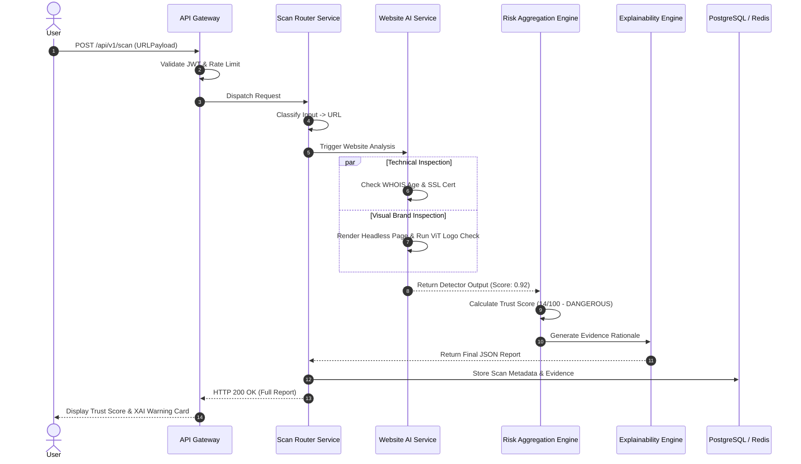

# TruthShield X
# System Architecture Document
## Version 1.0 — Unified Master Architectural Specification

---

# Document Information

| Field | Value |
|--------|-------|
| Project Name | TruthShield X |
| Document Code | 02-Architecture.md |
| Version | 1.0 (Unified Master) |
| Status | Approved Technical Specification |
| Architecture Style | AI-First Event-Driven Microservices |
| Prepared For | Smart India Hackathon 2026 & Production Deployment |
| Primary Stack | Python (FastAPI), React 19 (TypeScript), PyTorch, PostgreSQL, Neo4j, Qdrant, Redis, Docker/K8s |
| Last Updated | August 2026 |

---

# Table of Contents

1. Executive Architecture Overview
2. Architectural Goals & Success Criteria
3. 12 Core Architectural Principles
4. High-Level System Topology Blueprint
5. Monorepo & Folder Structure Specification
6. Core Microservices Catalog & Responsibilities
7. Unified Scan Engine & Auto-Classifier Pipeline
8. AI Gateway & Model Orchestration Architecture
9. Specialized AI Detection Microservices
10. Risk Aggregation & Trust Score Engine
11. Explainable AI (XAI) Rationale Engine
12. Threat Intelligence & Knowledge Graph Layer
13. Polyglot Persistence & Database Schemas
14. Frontend Application Architecture (React 19 + Vite)
15. Android Mobile Suite Architecture
16. Browser Extension Architecture (Manifest V3)
17. Real-Time Communication & Event Bus Topology
18. End-to-End Request Lifecycle & Sequence Diagrams
19. Zero-Trust Security, Privacy & DPDP Compliance
20. Observability, Telemetry & Disaster Recovery (RTO/RPO)
21. Architectural Decision Records (ADR Summary 001–010)
22. Architecture Governance & Sign-off

---

# 1. Executive Architecture Overview

**TruthShield X** is designed as **India's AI-Powered National Digital Trust & Cyber Defense Platform**. The architecture provides a unified, production-grade security infrastructure that detects and mitigates digital fraud across websites, media, documents, applications, communications, and financial channels.

Unlike legacy cybersecurity platforms that operate in siloed domains (e.g., standalone URL scanners or isolated deepfake detectors), TruthShield X adopts a **Unified Trust Engine Architecture**. Every incoming digital artifact—whether a URL, QR code image, voice clip, PDF document, SMS string, or Android APK binary—is processed through an automated intake classification layer, routed to domain-specific AI microservices, aggregated into a single **Digital Trust Score (0–100)**, and augmented with human-understandable **Explainable AI (XAI)** evidence.

---

# 2. Architectural Goals & Success Criteria

## Functional Architecture Goals
- **Multi-Modal Ingestion:** Ingest and auto-classify URLs, images, video, audio, text, PDFs, and APK files up to 500 MB.
- **Unified Risk Output:** Synthesize outputs from multiple specialized AI detectors into a single Trust Score (0–100).
- **Explainability by Default:** Guarantee every prediction is paired with explicit risk rationale and actionable recommendations.
- **Threat Intelligence Loop:** Feed anonymized threat telemetry directly into a national Knowledge Graph.

## Technical Architecture Goals
- **Domain-Driven Microservices:** Decouple business domains into independently deployable, containerized services.
- **Polyglot Persistence:** Match specialized storage engines to data characteristics (Relational, Graph, Vector, Cache, Object).
- **Asynchronous Execution:** Support non-blocking, event-driven processing for long-running AI inference tasks.
- **Low Latency Response:** Sub-300ms API gateway latency; <5s for Web scans; <3s for QR scans; <30s for 1080p Video Deepfake checks.
- **High Availability & Scale:** 99.9% uptime SLA; horizontal auto-scaling supporting 100,000+ active concurrent users.

---

# 3. 12 Core Architectural Principles

1. **AI-First Architecture:** Artificial Intelligence is the foundational decision engine, not an auxiliary plugin.
2. **Strict Microservice Isolation:** Services communicate exclusively via REST/gRPC/Events; direct database cross-access is strictly prohibited.
3. **API-First Strategy:** All functionalities are exposed via RESTful APIs consumed identically by Web, Mobile, Extension, and Third-Party Clients.
4. **Cloud-Native & Container-First:** Every service is containerized via Docker and orchestrated via Kubernetes (k8s) with horizontal auto-scaling.
5. **Security by Design & Zero Trust:** Enforce strict JWT validation, RBAC, input sanitization, TLS 1.3 encryption, and secret management (Vault).
6. **Explainability by Default (XAI):** Black-box decisions are rejected. Every output must provide verifiable evidence features.
7. **Asynchronous Event-Driven Pipelines:** Heavy AI tasks (Video/Audio/APK dynamic sandbox) run asynchronously using Celery/RabbitMQ task queues.
8. **Modular AI Model Interoperability:** AI models are decoupled behind standard interfaces, allowing instant model upgrades (e.g., swapping YOLO for RT-DETR) without backend refactoring.
9. **Full Observability & Traceability:** Every request carries a unique `Trace-ID` propagated across microservice logs, metrics, and traces.
10. **Dynamic Scalability:** Microservices scale independently based on hardware metrics (CPU, Memory, GPU VRAM utilization, Queue depth).
11. **Privacy by Design:** Strict adherence to India's DPDP Act 2023, featuring automated 30-day artifact purging and anonymous telemetry aggregation.
12. **Open Ecosystem Integration:** Modular interfaces ready for external integration with CERT-In, I4C, DigiLocker, Banking, and Telecom APIs.

---

# 4. High-Level System Topology Blueprint

```
                                  ┌─────────────────────────────────────────────────────────┐
                                  │                  CLIENT PLATFORMS                       │
                                  │  Web (React) | Android App | Extension | REST API Client│
                                  └────────────────────────────┬────────────────────────────┘
                                                               │
                                                       HTTPS / TLS 1.3
                                                               │
                                                               ▼
                                  ┌─────────────────────────────────────────────────────────┐
                                  │            API GATEWAY & LOAD BALANCER                  │
                                  │  NGINX / FastAPI Gateway (Auth, Rate Limit, CORS, WAF)  │
                                  └──────────────┬───────────────────────────┬──────────────┘
                                                 │                           │
                                     Synchronous REST/gRPC           Async Queue (RabbitMQ)
                                                 │                           │
                                                 ▼                           ▼
                                  ┌─────────────────────────────┐ ┌─────────────────────────┐
                                  │   AUTHENTICATION SERVICE    │ │   UNIFIED SCAN ENGINE   │
                                  │   (JWT, RBAC, OAuth2, AuthDB) │ │ (Auto-Classify & Route) │
                                  └─────────────────────────────┘ └────────────┬────────────┘
                                                                               │
                                                                               ▼
                                                                  ┌─────────────────────────┐
                                                                  │       AI GATEWAY        │
                                                                  │ (Model Registry & GPU)  │
                                                                  └────────────┬────────────┘
                                                                               │
       ┌────────────────────┬────────────────────┬────────────────────┼────────────────────┬────────────────────┐
       ▼                    ▼                    ▼                    ▼                    ▼                    ▼
┌──────────────┐     ┌──────────────┐     ┌──────────────┐     ┌──────────────┐     ┌──────────────┐     ┌──────────────┐
│  Website AI  │     │   QR / UPI   │     │   Deepfake   │     │ Audio / Voice│     │ Document OCR │     │  NLP & Text  │
│  Inspection  │     │  Validation  │     │  Vision AI   │     │   Analysis   │     │  Inspection  │     │  Inspection  │
└──────┬───────┘     └──────┬───────┘     └──────┬───────┘     └──────┬───────┘     └──────┬───────┘     └──────┬───────┘
       │                    │                    │                    │                    │                    │
       └────────────────────┴────────────────────┼────────────────────┴────────────────────┴────────────────────┘
                                                 │
                                                 ▼
                                  ┌─────────────────────────────┐
                                  │   RISK AGGREGATION ENGINE   │
                                  │ (Trust Score 0-100 & Rules) │
                                  └──────────────┬──────────────┘
                                                 │
                                                 ▼
                                  ┌─────────────────────────────┐
                                  │    EXPLAINABILITY ENGINE    │
                                  │   (XAI Rationale & Evidence)│
                                  └──────────────┬──────────────┘
                                                 │
                                                 ▼
                                  ┌─────────────────────────────┐
                                  │  POLYGLOT PERSISTENCE LAYER │
                                  │ PostgreSQL | Redis | Neo4j  │
                                  │    Qdrant | MinIO Storage   │
                                  └─────────────────────────────┘
```

---

# 5. Monorepo & Folder Structure Specification

TruthShield X uses a unified, enterprise monorepo structure separating frontend applications, backend services, AI models, shared libraries, infrastructure code, and technical documentation.

```
truthshield-x/
├── apps/
│   ├── web/                        # React 19 + TypeScript Web Portal
│   ├── android/                    # Native Android Mobile Application
│   ├── browser-extension/          # Chrome/Firefox Manifest V3 Extension
│   └── admin-dashboard/            # Institutional & Government Analytics Portal
│
├── backend/
│   ├── gateway/                    # API Gateway (NGINX / FastAPI)
│   ├── auth-service/               # User Authentication & RBAC Service
│   ├── scan-service/               # Unified Intake & Scan File Router
│   ├── threat-service/             # Threat Intelligence & Graph Feed Service
│   ├── notification-service/       # Push, Email & SMS Notification Engine
│   └── report-service/             # PDF & Audit Report Generation Service
│
├── ai-services/
│   ├── website-ai/                 # Headless Scraper, DOM & Brand Vision Service
│   ├── qr-ai/                      # QR Decoder & UPI Risk Validator
│   ├── deepfake-ai/                # Image & Video Deepfake Detection Models
│   ├── audio-ai/                   # Voice Clone & Speech-to-Text Fraud Service
│   ├── document-ai/                # Aadhaar/PAN/DL OCR & Forgery Inspector
│   ├── nlp-ai/                     # Text Phishing, Scam SMS & Fake News Service
│   ├── risk-engine/                # Risk Aggregation & Trust Score Calculator
│   └── explainability/             # Explainable AI (XAI) Rationale Engine
│
├── packages/
│   ├── ui/                         # Shared Design System Component Library
│   ├── shared/                     # Utility Functions & Common Libraries
│   ├── config/                     # Shared ESLint, TypeScript & Tailwind Configs
│   └── types/                      # Common TypeScript Interfaces & DTO Schemas
│
├── infrastructure/
│   ├── docker/                     # Dockerfiles & Local docker-compose.yml
│   ├── kubernetes/                 # K8s Manifests (Helm Charts, Ingress, Deployments)
│   └── terraform/                  # Cloud Infrastructure Provisioning Scripts
│
├── datasets/                       # Model Evaluation & Benchmark Test Sets
├── docs/                           # Project Technical Documentation Specifications
│   ├── 01-PRD.md                   # Master Product Requirements Document
│   ├── 02-Architecture.md          # Master Architecture Specification
│   ├── 03-Rules.md                 # Development & Coding Rules
│   └── 04-Phases.md                # Project Execution Plan
└── scripts/                        # Database Migration & Development Helpers
```

---

# 6. Core Microservices Catalog & Responsibilities

| Service Name | Port | Primary Tech | Primary Responsibility |
|---|---|---|---|
| **API Gateway** | 8000 / 443 | NGINX / FastAPI | SSL Termination, Rate Limiting, Request Routing, JWT Validation. |
| **Auth Service** | 8001 | FastAPI, PostgreSQL, Redis | User Registration, Password Hashing (Argon2id), JWT Token issuing. |
| **Scan Router Service** | 8002 | FastAPI, Celery, MinIO | Artifact intake, File Type Detection, Storage, Async Task Queueing. |
| **AI Gateway Service** | 8010 | FastAPI, PyTorch, ONNX | Model Loading, GPU Resource Scheduling, Inference Routing. |
| **Website AI Service** | 8011 | Python, Playwright, OpenCV | Headless Page Rendering, WHOIS inspection, Vision Logo Comparison. |
| **QR / UPI AI Service** | 8012 | Python, OpenCV, ZXing | QR Matrix Decoding, UPI VPA Parsing & Threat Registry Verification. |
| **Deepfake Vision AI** | 8013 | PyTorch, OpenCV, TIMM | Image GAN artifact check, Video frame lip-sync & temporal inspection. |
| **Audio AI Service** | 8014 | PyTorch, Whisper, Wav2Vec | Speech-to-Text Transcription, Voice Clone Spectral Analysis. |
| **Document OCR AI** | 8015 | Python, PaddleOCR, OpenCV | Aadhaar/PAN/DL Structural Extraction, QR Validation, PDF Script Check. |
| **NLP & Text AI** | 8016 | HuggingFace, Transformers | Phishing Email NLP, Scam SMS Classification, Fake News Fact-Check. |
| **Risk Engine Service** | 8020 | Python, scikit-learn | Score Fusion, Risk Matrix Calculation, Digital Trust Score (0-100). |
| **Explainability Engine** | 8021 | Python, SHAP | Evidence Rationale Formatting, Human-Readable Explanation Generation. |
| **Threat Intelligence** | 8030 | FastAPI, Neo4j, Qdrant | Scam Graph Operations, Vector Similarity Search, Anonymized Telemetry. |
| **Notification Service** | 8040 | Node.js, RabbitMQ, Firebase | Email (SendGrid), SMS (Twilio), Mobile Push Notification Dispatch. |
| **Report Generation** | 8050 | Python, ReportLab | Exportable PDF Verification Certificate & Detailed Audit Reports. |

---

# 7. Unified Scan Engine & Auto-Classifier Pipeline

The **Unified Scan Engine** removes the cognitive burden from users by eliminating manual artifact selection.

```
Incoming Request Payload (File, URL, Text, Camera Stream)
                       │
                       ▼
            MIME & Byte Inspection
                       │
         ┌─────────────┴─────────────┐
         │ Is Content String a URL?  │── YES ──► Route: Website AI Service
         └─────────────┬─────────────┘
                       │ NO
         ┌─────────────┴─────────────┐
         │ Magic Bytes = %PDF-?      │── YES ──► Route: Document AI Service
         └─────────────┬─────────────┘
                       │ NO
         ┌─────────────┴─────────────┐
         │ Magic Bytes = PK\x03\x04?  │── YES ──► Check AndroidManifest.xml
         └─────────────┬─────────────┘                 ├─ Found? ──► Route: APK Sandbox Service
                       │ NO                            └─ Zip/Doc? ─► Route: Document AI Service
         ┌─────────────┴─────────────┐
         │ Image Format (PNG/JPG)?   │── YES ──► Check 2D Matrix Code (QR)
         └─────────────┬─────────────┘                 ├─ QR Found? ─► Route: QR / UPI AI Service
                       │ NO                            └─ No QR? ────► Route: Deepfake Vision AI
         ┌─────────────┴─────────────┐
         │ Audio / Video Container?  │── YES ──► Route: Audio / Video AI Service
         └─────────────┬─────────────┘
                       │ NO
                       ▼
            Route: NLP & Text AI Service
```

---

# 8. AI Gateway & Model Orchestration Architecture

The **AI Gateway** acts as the central control plane for all deep learning models across GPU and CPU clusters.

```
                     ┌──────────────────────────────────┐
                     │       AI GATEWAY MANAGER         │
                     └────────────────┬─────────────────┘
                                      │
        ┌─────────────────────────────┼─────────────────────────────┐
        ▼                             ▼                             ▼
┌──────────────┐              ┌──────────────┐              ┌──────────────┐
│ Model        │              │ GPU VRAM     │              │ Dynamic      │
│ Registry     │              │ Allocator    │              │ Batching     │
│ (ONNX/Torch) │              │ & Scheduler  │              │ Queue        │
└──────────────┘              └──────────────┘              └──────────────┘
```

## Key Capabilities:
- **Model Registry:** Manages active model versions, ONNX runtime runtimes, weights checkpoints, and rollback targets.
- **VRAM Allocation & GPU Scheduling:** Dynamically routes heavy inference jobs (Video Deepfake 3D-CNNs) to dedicated GPU worker nodes (NVIDIA T4/A10G).
- **Fallback Execution:** Automatically falls back to optimized CPU ONNX Runtime nodes if GPU VRAM threshold exceeds 95%.
- **Dynamic Batching:** Groups concurrent single-image inference requests into batch vectors of size 8/16 for 4x throughput efficiency.

---

# 9. Specialized AI Detection Microservices

## 9.1 Website AI Inspection Service
- **Headless Scraper:** Uses Playwright to render target web pages, execute dynamic JS, and capture 1080p full-page screenshots.
- **Technical Profiler:** Evaluates domain WHOIS age (<30 days flag), SSL certificate integrity, DNS records, and redirect chains.
- **Vision Brand Matching:** Utilizes Vision Transformers (ViT) to compare captured web screenshot layout against authentic bank/portal reference assets.

## 9.2 QR & UPI Risk Service
- **Matrix Extraction:** OpenCV + ZXing decodes high-resolution or distorted QR matrices.
- **UPI URI Parsing:** Extracts Payee Name, Virtual Payment Address (VPA), and Transaction Code from `upi://pay` URIs.
- **Threat Registry Lookup:** Queries Redis cache & Neo4j graph for historical fraud reports against target VPA.

## 9.3 Deepfake Vision AI Service
- **Image Artifact Engine:** Analyzes GAN/Diffusion noise signatures, frequency spectrum anomalies, and pixel boundary inconsistencies.
- **Video Temporal Engine:** Extracts spatial face crops, evaluates frame-by-frame lip-sync correlation, eye blink frequency, and face-swap seam lines.

## 9.4 Audio & Voice Analysis Service
- **Automatic Speech Recognition (ASR):** Converts audio streams to text transcripts using Whisper supporting English & Indian regional languages.
- **Voice Clone Detector:** Extracts Mel-frequency cepstral coefficients (MFCC) and speaker embeddings to identify synthetic neural voice signatures (Tacotron/ElevenLabs).

## 9.5 Document OCR & Forgery Service
- **Layout OCR:** PaddleOCR extracts alphanumeric fields from uploaded Aadhaar, PAN, and Driving Licence documents.
- **Structure Inspector:** Compares field alignment, state font templates, photo overlay boundaries, and recalculates Aadhaar 12-digit Verhoeff checksums.

## 9.6 NLP & Text AI Service
- **Intent Classifier:** DeBERTa Transformer model detects urgency, credential threats, and coercive financial extortion in SMS/Email text.
- **Fact Verification:** Extracts claims from input text and queries trusted knowledge graphs to rate news authenticity.

---

# 10. Risk Aggregation & Trust Score Engine

The Risk Aggregation Engine combines individual detector outputs through a weighted matrix calculation:

$$\text{Risk Score} = \sum_{i=1}^{n} (W_i \times S_i)$$

Where:
- $W_i$ = Assigned weight of Detector Module $i$
- $S_i$ = Normalized threat probability $(0.0 \text{ to } 1.0)$ output by Detector $i$

$$\text{Digital Trust Score} = \max(0, \min(100, 100 \times (1 - \text{Risk Score})))$$

## Module Weight Distribution Table

| Detector Module ($i$) | Weight ($W_i$) | Primary Indicators |
|---|---|---|
| Domain / URL Inspection | 0.25 | Domain Age < 7 days, SSL mismatch, Known Blacklist IP |
| Visual Brand Impersonation | 0.25 | Logo similarity score > 85% on unofficial domain |
| Deepfake Media Artifacts | 0.25 | GAN noise, lip-sync mismatch, synthetic voice signature |
| Threat Intelligence Graph | 0.15 | Active fraud reports on VPA / Phone / Domain |
| NLP & Text Urgency | 0.10 | Coercive financial language, credential phishing triggers |

## Trust Score Classifications

```
  0 ────── 29          30 ────── 49          50 ────── 69          70 ────── 89          90 ────── 100
┌──────────────┐     ┌──────────────┐     ┌──────────────┐     ┌──────────────┐     ┌──────────────┐
│  DANGEROUS   │     │  HIGH RISK   │     │ MEDIUM RISK  │     │   LOW RISK   │     │   TRUSTED    │
│    (Red)     │     │   (Orange)   │     │   (Yellow)   │     │    (Blue)    │     │   (Green)    │
└──────────────┘     └──────────────┘     └──────────────┘     └──────────────┘     └──────────────┘
```

---

# 11. Explainable AI (XAI) Rationale Engine

The **Explainability Engine** translates raw mathematical probabilities into transparent, human-readable evidence.

```json
{
  "scanId": "scan_9f82a1...",
  "trustScore": 14,
  "riskLevel": "DANGEROUS",
  "confidence": 0.96,
  "xaiSummary": {
    "headline": "High Risk Phishing & Impersonation Portal",
    "keyEvidence": [
      {
        "factor": "Domain Age",
        "severity": "CRITICAL",
        "description": "Domain 'sbi-netbanking-update.xyz' was registered 2 days ago."
      },
      {
        "factor": "Brand Impersonation",
        "severity": "CRITICAL",
        "description": "Page visually clones State Bank of India logo on an unauthorized domain."
      },
      {
        "factor": "SSL Certificate",
        "severity": "HIGH",
        "description": "Domain lacks standard organizational SSL validation."
      }
    ],
    "userAction": [
      "Do NOT enter net banking credentials or OTPs.",
      "Close immediately and report link via official bank portal."
    ]
  }
}
```

---

# 12. Threat Intelligence & Knowledge Graph Layer

Threat Shield X maintains a dynamic **Scam Knowledge Graph** in Neo4j to track relationships across fraudulent entities:

```
 (User Report) ──► [Reported VPA] ──► USED_IN ──► (Scam Campaign)
                                                      │
                                                  LINKED_TO
                                                      ▼
 (Malicious APK) ◄── DISTRIBUTES ◄── [Domain] ◄── HOSTS ── (Phishing IP)
```

- **Neo4j Nodes:** `Domain`, `IPAddress`, `UPI_VPA`, `PhoneNumber`, `ScamCampaign`, `APKHash`.
- **Qdrant Vector DB:** Stores 512-dimensional visual embeddings of phishing webpage screenshots and deepfake face crops for instantaneous similarity matching.

---

# 13. Polyglot Persistence & Database Schemas

## Polyglot Database Selection Matrix

| Storage Engine | Purpose | Workload Type |
|---|---|---|
| **PostgreSQL 16** | Core System Storage | Users, Roles, Scan History Metadata, API Keys, Audit Logs |
| **Redis Cluster** | In-Memory Cache & Session | JWT Blacklist, Rate Limiting Counters, Active Job Progress |
| **Neo4j 5.x** | Graph Database | Scam Networks, Fraud Entity Relationships, Campaign Linking |
| **Qdrant** | Vector Search Engine | Media Feature Embeddings, Visual Screenshot Similarity Search |
| **MinIO / AWS S3** | Object Storage | Uploaded Artifact Files, Screen Captures, Generated PDF Reports |

## Core PostgreSQL Schema DDL Blueprint

```sql
-- Users & Core Authentication
CREATE TABLE users (
    user_id UUID PRIMARY KEY DEFAULT gen_random_uuid(),
    email VARCHAR(255) UNIQUE NOT NULL,
    password_hash VARCHAR(255) NOT NULL,
    full_name VARCHAR(100) NOT NULL,
    role VARCHAR(50) NOT NULL DEFAULT 'CITIZEN',
    created_at TIMESTAMP WITH TIME ZONE DEFAULT CURRENT_TIMESTAMP,
    updated_at TIMESTAMP WITH TIME ZONE DEFAULT CURRENT_TIMESTAMP
);

-- Scan Metadata Registry
CREATE TABLE scans (
    scan_id UUID PRIMARY KEY DEFAULT gen_random_uuid(),
    user_id UUID REFERENCES users(user_id) ON DELETE SET NULL,
    artifact_type VARCHAR(50) NOT NULL,
    artifact_hash VARCHAR(64) NOT NULL,
    storage_path VARCHAR(512),
    trust_score INT CHECK (trust_score BETWEEN 0 AND 100),
    risk_level VARCHAR(20) NOT NULL,
    status VARCHAR(20) NOT NULL DEFAULT 'PROCESSING',
    created_at TIMESTAMP WITH TIME ZONE DEFAULT CURRENT_TIMESTAMP
);

-- Explainable AI Evidence Results
CREATE TABLE scan_evidence (
    evidence_id UUID PRIMARY KEY DEFAULT gen_random_uuid(),
    scan_id UUID REFERENCES scans(scan_id) ON DELETE CASCADE,
    detector_name VARCHAR(100) NOT NULL,
    severity VARCHAR(20) NOT NULL,
    factor_name VARCHAR(100) NOT NULL,
    description TEXT NOT NULL,
    raw_score FLOAT NOT NULL
);
```

---

# 14. Frontend Application Architecture (React 19 + Vite)

The web client uses **React 19**, **TypeScript**, and **Vite** structured with feature-based encapsulation.

```
apps/web/src/
├── app/                        # Main Router, Providers & Global Layouts
├── assets/                     # Icons, Logos & Static Media
├── components/                 # Atomic UI Components (Buttons, Inputs, Cards)
├── features/                   # Domain Feature Modules
│   ├── auth/                   # Login, Register, Password Reset Views
│   ├── dashboard/              # User Metrics & Recent Activity Summary
│   ├── scan/                   # Multi-Modal Upload Center & Dynamic Scanner
│   ├── reports/                # Detailed XAI Report Viewer & PDF Exporter
│   └── threat-map/             # Interactive Threat Intelligence Map View
├── hooks/                      # Custom React Hooks (useScan, useAuth)
├── services/                   # TanStack Query API Client Wrappers
├── store/                      # Zustand Global Application State Stores
├── types/                      # TypeScript DTO & API Interfaces
└── utils/                      # Helper Functions (Formatting, Validation)
```

## Core State Architecture:
- **Zustand:** Controls client-side state (Active User Session, Theme Toggle, Modal Visibility).
- **TanStack Query (React Query):** Manages server-side asynchronous data fetching, caching, polling scan status, and optimistic UI updates.

---

# 15. Android Mobile Suite Architecture

The native Android app follows **MVVM (Model-View-ViewModel)** clean architecture.

```
  [ UI Layer (Jetpack Compose Views) ]
                  │
                  ▼
 [ ViewModel Layer (StateFlow / Coroutines) ]
                  │
                  ▼
  [ Repository Layer (Single Source of Truth) ]
         │                           │
         ▼                           ▼
[ Remote (Retrofit API) ]   [ Local (Room Database) ]
```

## Key Capabilities:
- **Camera QR Scanner:** Real-time camera feed analysis extracting and verifying QR code payloads instantly.
- **SMS Security Watcher:** Background broadcast receiver capturing incoming SMS strings, parsing embedded URLs, and providing instant safety notifications.
- **Scam Call Recorder Assistant:** Audio intake module converting call clips to transcripts for immediate fraud intent detection.

---

# 16. Browser Extension Architecture (Manifest V3)

The extension provides passive real-time protection during web browsing.

```
               ┌───────────────────────────────────────────────┐
               │        BROWSER CONTENT SCRIPT (DOM)           │
               └──────────────────────┬────────────────────────┘
                                      │
                         Page Loaded URL & Screenshot
                                      │
                                      ▼
               ┌───────────────────────────────────────────────┐
               │     BACKGROUND SERVICE WORKER (Manifest V3)   │
               └──────────────────────┬────────────────────────┘
                                      │
                  Check Local Bloom Filter / Call API
                                      │
                                      ▼
               ┌───────────────────────────────────────────────┐
               │         POPUP OVERLAY / WARNING BADGE         │
               └───────────────────────────────────────────────┘
```

---

# 17. Real-Time Communication & Event Bus Topology

For long-running AI inference tasks (e.g., Video Deepfake processing), TruthShield X uses an asynchronous event bus built on **RabbitMQ** and **WebSockets**.

```
Client App                   Scan Service                RabbitMQ Queue             Deepfake AI Worker
    │                             │                            │                            │
    │── POST /api/v1/scan ───────►│                            │                            │
    │   (Async Upload)            │                            │                            │
    │                             │── Publish Event ──────────►│                            │
    │◄── HTTP 202 Accepted ───────│   "scan.created"           │                            │
    │   (Returns TaskID)          │                            │── Consume Event ──────────►│
    │                             │                            │   "scan.created"           │
    │                             │                            │                            │── Execute 3D-CNN Frame
    │                             │                            │                            │   Inference
    │                             │                            │◄── Publish Result ─────────│
    │                             │◄── Event: "scan.done" ─────│   "scan.done"              │
    │                             │                            │                            │
    │◄── WebSocket Notification ──│                            │                            │
    │   "Scan Complete: Score 14" │                            │                            │
```

---

# 18. End-to-End Request Lifecycle & Sequence Diagrams

## Sequence Diagram: URL Phishing Verification Flow



---

# 19. Zero-Trust Security, Privacy & DPDP Compliance

- **Zero-Trust Boundaries:** All internal inter-service calls require mutual TLS (mTLS) or signed internal service JWTs.
- **DPDP Act 2023 Compliance:**
  - **Right to Erasure:** Users can request immediate deletion of scan histories via single API call (`DELETE /api/v1/history`).
  - **Automatic Artifact Purging:** Uploaded media files in MinIO storage are automatically destroyed after 30 days via lifecycle retention rules.
- **Secrets Management:** Environment passwords, database credentials, and private key signatures are injected via **HashiCorp Vault**.

---

# 20. Observability, Telemetry & Disaster Recovery (RTO/RPO)

## Observability Stack
- **Prometheus:** Collects API response latencies, system CPU/Memory metrics, and GPU VRAM utilization.
- **Grafana:** Displays real-time system performance, active scan queues, and error rate dashboards.
- **ELK Stack (Elasticsearch, Logstash, Kibana):** Centralizes structured JSON log entries across all microservices.

## Disaster Recovery Objectives
- **Recovery Time Objective (RTO):** $< 2$ Hours (Time to fully restore platform services after a datacenter outage).
- **Recovery Point Objective (RPO):** $< 15$ Minutes (Maximum allowable data loss window, guaranteed via automated PostgreSQL WAL replication every 15 minutes).

---

# 21. Architectural Decision Records (ADR Summary 001–010)

| ADR ID | Decision Title | Decision Status | Core Rationale |
|---|---|---|---|
| **ADR-001** | Microservices Architecture | Approved | Enables independent scaling of GPU-heavy AI services versus lightweight API endpoints. |
| **ADR-002** | FastAPI for Backend Services | Approved | Offers high async throughput, native Pydantic typing, and direct Python AI ecosystem integration. |
| **ADR-003** | Unified Scan Engine Intake | Approved | Simplifies user experience by auto-classifying inputs without manual tool selection. |
| **ADR-004** | Centralized AI Gateway | Approved | Prevents GPU VRAM exhaustion, manages model versions, and enforces ONNX CPU fallback. |
| **ADR-005** | Polyglot Persistence Approach | Approved | PostgreSQL for relational metadata, Neo4j for threat networks, Qdrant for vector embeddings. |
| **ADR-006** | Explainable AI (XAI) Standard | Approved | Mandatory transparent evidence generation ensures user trust and government compliance. |
| **ADR-007** | Asynchronous RabbitMQ Pipeline | Approved | Non-blocking execution for long-running video deepfake and APK dynamic sandbox jobs. |
| **ADR-008** | React 19 + Vite Frontend | Approved | Fast build times, modern component model, type-safe development using TypeScript. |
| **ADR-009** | DPDP 2023 Privacy Standard | Approved | Enforces explicit user consent, automatic 30-day file purging, and anonymized telemetry. |
| **ADR-010** | Containerized Deployment (K8s) | Approved | Provides seamless cloud-native deployment and horizontal pod auto-scaling (HPA). |

---

# 22. Architecture Governance & Sign-off

## Approval Matrix

| Role | Name / Title | Status | Date |
|---|---|---|---|
| **Solution Architect** | Principal Systems Architect | Approved | August 2026 |
| **AI Engineering Lead** | Head of Artificial Intelligence | Approved | August 2026 |
| **Security Lead** | Chief Information Security Officer | Approved | August 2026 |
| **Lead Developer** | Senior Full-Stack Engineer | Approved | August 2026 |

## Final Sign-off Statement
This System Architecture Document (`02-Architecture.md v1.0`) defines the authoritative technical blueprint for **TruthShield X**. All subsequent implementation tasks, microservice developments, database provisioning, and interface designs shall adhere strictly to the architectural standards established herein.

---
**[ END OF UNIFIED ARCHITECTURE SPECIFICATION v1.0 ]**
